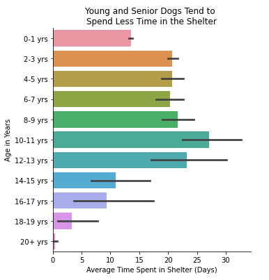
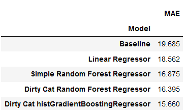

# Predicting Shelter Time for Austin Animal Center Dogs
## Introduction
In 2016, my dog, Ryder, was found abandoned on the beaches of Galveston, Texas, matted and suffering from heartworm disease. Shortly upon adopting him, my wife and I began taking pictures of him to see if anyone could identify what breed he was. This led to his [Instagram](https://www.instagram.com/shannonkatecypress/) page amassing over 6,000 followers and brand modeling deals. After being active in the Instagram dog community for so long, I was curious to see how I could apply my data analytical skills to help the rescue community and find forever homes for dogs in need. I was excited to apply the skills I used to analyze what worked for our own Instagram brand, and use them to advance growth and create useful strategies for the community I have grown familiar with.

The **Austin Animal Center** is the municipal shelter for the city of Austin. They accept both stray and surrendered animals regardless of status or species. They take in approximately 20,000 animals each year. The shelter prides itself in providing "live outcomes" to over 90% of the intake animals each year. Examples of live outcomes include adoption, foster care, or transfer to another rescue or facility. To improve the odds of live outcomes for their animals, they host adoption events, organize shelter transfer programs, and offer owner surrender consultations.

Due to the large influx of animals accepted into the shelter, **overcapacity is a major issue that the shelter often faces**. This project aims to help mitigate that issue for the Austin Animal Center by using past animal features to predict the estimated shelter time a dog will spend before its outcome. Using this, we can create strategies for dogs that are predicted to have long shelter times and improve their odds of a live outcome in a shorter period of time.

## Data Wrangling and Exploratory Data Analysis
### Data Source
The data was separated by [intake](https://data.austintexas.gov/Health-and-Community-Services/Austin-Animal-Center-Intakes/wter-evkm) and [outcome](https://data.austintexas.gov/Health-and-Community-Services/Austin-Animal-Center-Outcomes/9t4d-g238). Both datasets are updated on a daily basis with each animal having a unique animal ID. This project is modeled after a snapshot of the data taken between October 2013 to April 2022.

### Data Cleaning
Both datasets were merged on their unique Animal ID and contained features such as name, age, breed, intake condition, intake date, gender, outcome, outcome date, and more. Using the intake and outcome dates, I created a calculated field for the target variable containing the shelter time. Then I explored different features and how they correlated to my target variable, for example with Age in the chart below.

Certain features needed to be cleaned for modeling, such as the Breed column. The breed column contained over 2000 different combinations of breeds that I binned to a more generalized list based off thetop 50 most popular breeds of 2021 created by the [American Kennel Club](https://www.akc.org/expert-advice/dog-breeds/most-popular-dog-breeds-of-2021/).

For example, if the dog breed was a "Pit Bull / Dachshund Mix", it would categorize into the Pit Bull bin as it is higher up on the list of most popular breeds. Any entries that did not fit any of the breed categories were given a breed category of "Other".

## Modeling

From the correlation maps and our graphical exploratory data analysis, I selected age, breed, intake condition, intake type and sex as features due to having some sort of correlation with the range of our target variable, shelter time. The data was split into train and test sets with each model being trained on the train set, leaving the test set untouched until I evaluate the models. 

The models used were:
- Linear Regressor
- Random Forest Regressor
- HistGradientBoosting Regressor

I also used a library called [dirty_cat](https://dirty-cat.github.io/stable/) to help transform and scale my categorial features with high cardinality. 

## Results

The metric chosen to evaluate the models was Mean Absolute Error (MAE), which calculates the difference between the actual value and the predicted value from the model. I chose MAE over the Root Mean Squared Error (RMSE) for the metric since RMSE weighs large errors more highly.

From the chart above, it can be seen that a histGradientBoosting Regressor model predicted our test set the best out of all my tested models. The model seems to have difficulties with predictions for dogs with shelter times that were outliers, more than 1.5 times the IQR.

## Conclusion

The model created using a histGradientBoosting Regressor model can predict the estimated time a dog spends in the Austin Animal Shelter to a degree of certainty with a mean absolute error of approximately 15 days. Using our model, we predicted that Patches, an injured spayed female pit bull of around 9-10 years old would have a shelter time of over 2 years. Even though the actual amount of time for Patches was over 5 years before she was adopted, it would alert the Austin Animal Center to her situation and allow then to improve her live outcome odds via social media promotions or through shelter exchange programs.
