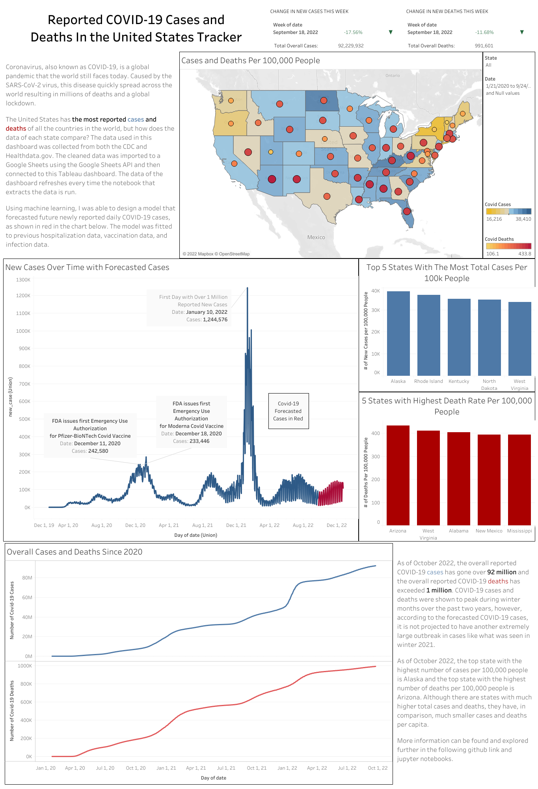
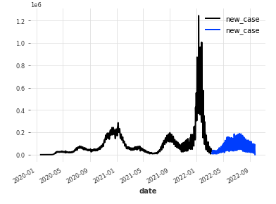

# COVID-19 Cases and Deaths

You can visit my Public Tableau Dashboard featuring the data from these notebooks at the following [link](https://public.tableau.com/app/profile/tony.tran2362/viz/COVID-19Data_16637479536980/ReportedCOVID-19CasesandDeathsIntheUnitedStatesTracker).

## Introduction
Coronavirus (COVID-19) is an infectious respiratory disease caused by the SARS-CoV-2 virus. The virus, being highly infectious, sparked a global pandemic and caused mandatory quarantines around the globe. By the end of 2020, vaccines were approved for administration and over time, have proven to decrease the chance of infection and the severity of the symptoms. However, COVID-19 is still an issue to this day and we have seen sporatic spikes in COVID-19 contraction since. As of July 2022, COVID-19 has over 6 million world wide confirmed deaths and over 569 million cases of the disease. The United States, covered in this project, has around 1 million of those deaths and over 90 million cases.

This project aims to analyze previous COVID-19 data collected from the CDC and HealthData.gov, interpret trends between state data, and accurately forecast future cases and deaths in the United States. Each time this notebook is executed, it will extract the most current data straight from the site and create an updated model. It will also update the Tableau dashboard with its newly wrangled and forecasted data, creating an up to date analysis of data each time the notebook is run.

## Data Wrangling and Exploratory Data Analysis
### Data Source

The three datasets are as follows:
- [Covid-19 Reported Patient Impact and Hospital Capacity by State Timeseries collected from healthdata.gov](https://healthdata.gov/Hospital/COVID-19-Reported-Patient-Impact-and-Hospital-Capa/g62h-syeh)
- [Vaccine Distribution and Administration by State collected from the CDC](https://data.cdc.gov/Vaccinations/COVID-19-Vaccinations-in-the-United-States-Jurisdi/unsk-b7fc)
- [Covid Cases and Deaths Over Time collected from the CDC](https://data.cdc.gov/Case-Surveillance/United-States-COVID-19-Cases-and-Deaths-by-State-o/9mfq-cb36)

### Data Cleaning

The data sets were merged on the dates into a single timeseries dataframe. With differences in data collection and reporting rate there were a few instances of null values that needed to be addressed before modeling. For vaccination data, since vaccines were not distributed until later in 2020, had many null values between 2020-2021. The null values for those dates were backfilled with previous values. We choose not to remove any rows with null values due to potentially removing other important information and missing a date in the timeseries data.

## Modeling

I chose to use Mean Absolute Scaled Error (mase) over Mean Absolute Percentage Error (mape) as the metric to evaluate my models due to the data having zero values. This is due to, for example, the time before the vaccine was created and the number of vaccines administered was zero.

If we have zero values and attempt to use mape, we will receive an error. The mean absolute scaled error is also unaffected by scale, which is beneficial for the Covid-19 data that features multiple columns.

I used a library called [darts](https://unit8co.github.io/darts/) to aid in timeseries forecasting. I begin by testing the default models built into the darts library against a baseline seasonal naive model I created.

Exponential Smoothing is a method for predicting univariate time series data (it focuses on just one variable, in this case, time). It predicts based off a weighted linear sum of past values, but gives an exponentially lower weight to further past values.

TBATS is a method that uses Exponential Smoothing, but its main focus is to fit with data with complex seasonal trends.

ARIMA (AutoRegressive Integrated Moving Average) is regressive, meaning it makes judgements based on past values and assumes that the future will resemble the past. It uses lagged moving averages to smoothen the data.

AutoARIMA searches for the best ARIMA model based on restaints provided.

Each of these did not provide a MASE score to my expectations, so I also tried a Random Forest Regressor and Gradient Boosting model. Ultimately, I ended with a HistGradientBoosting model that provided me with the most accurate prediction. This model is what I used to forecast the next three months of COVID-19 cases.

## Conclusion
As of October 2022, the overall reported cases in the United States has gone over 92 million and the overall reported deaths due to COVID exceeded 1 million. COVID-19 cases were shown to peak in during the winter months for both years, however, my model predicted that there was not going to be an extremely large outbreak like what was seen in the end of 2021. Using [population census data for 2021](https://www2.census.gov/programs-surveys/popest/datasets/2020-2021/state/totals/), the per case and death rates were calculated per 100,000 people. This calculation showed Alaska had the largest per capita case total and Arizona showed the larged per capita death total.

In the end, the model I choose gave a MASE score of 1.65, meaning that the model ultimately needed work. In the future, I would hope to reevaluate this model when I have more data to work with. I would also look into exploring infection and case rates worldwide.

